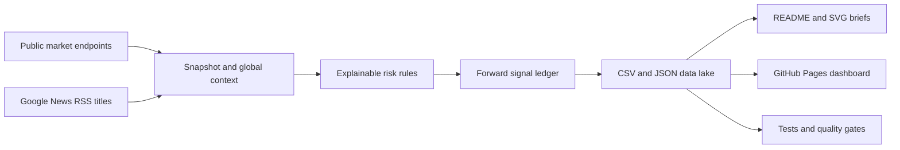

<div align="center">

# 📈 A-Share Pulse

**A Git-native market weather station for China A-shares.**

Five daily checkpoints connect mainland breadth and sentiment with US, Japan,
Hong Kong, volatility, rates, and the news cycle — with no runtime dependencies.

<a href="https://github.com/ychenfen/a-share-daily/actions/workflows/daily.yml"></a>
<a href="https://ychenfen.github.io/a-share-daily/"></a>


<a href="LICENSE"></a>

[简体中文](README.md) · English

</div>

<a href="https://ychenfen.github.io/a-share-daily/"></a>

[Live dashboard](https://ychenfen.github.io/a-share-daily/) ·
[Use this template](https://github.com/ychenfen/a-share-daily/generate) ·
[Latest JSON](data/latest.json) ·
[Full history](data/) ·
[Data schema](docs/DATA_SCHEMA.en.md) ·
[Actions](https://github.com/ychenfen/a-share-daily/actions) ·
[Discussions](https://github.com/ychenfen/a-share-daily/discussions) ·
[Roadmap](ROADMAP.md)

## Why this repository is different

| Capability | What it gives you |
| --- | --- |
| Five market checkpoints | Overnight context plus open, midday, close, and evening verification instead of one end-of-day row |
| Cross-market context | A-shares alongside the S&P 500, Nasdaq, Dow, Hang Seng, Nikkei 225, Europe, A50 futures, USD/CNH, DXY, gold, oil, VIX, and US 10Y |
| Explainable risk score | Every point is attributed to momentum, breadth, sentiment, global markets, volatility, rates, or low-weight news tone |
| Falsifiable event chains | Deduplicated headlines map to macro variables, A-share styles and sectors, live confirmations, and explicit invalidation conditions |
| Forward-only scorecard | Signals are recorded before outcomes and settled over 1, 3, and 5 sessions; no invented historical hit rate |
| Visible source health | Fresh, partial, stale, and missing upstream data remain visible rather than being silently presented as current |
| Git-native data lake | Every changed observation has a diff, timestamp, and rollback path; CSV and JSON stay easy to reuse |
| Zero runtime dependencies | Python standard library plus GitHub Actions; no database, paid API, or server required |

## Today's shareable brief

<a href="https://ychenfen.github.io/a-share-daily/#share"></a>

[Open the interactive desk](https://ychenfen.github.io/a-share-daily/) ·
[Download the SVG brief](charts/daily_brief.svg)

The card is regenerated by the same audited pipeline as the data. In A-share
convention, **red means up and green means down**.

## How it works



The score is a transparent research heuristic, not a model-generated trade.
News headlines have bounded, low weight and are never treated as verified facts.
A deterministic ruleset also groups deduplicated headlines into auditable event
chains: clue → macro transmission → A-share lens → invalidation. These chains do
not add points to the score; live market observations confirm or reject them.
A50 futures and the USD/CNH-DXY pair are capped, low-weight inputs. Gold and
WTI stay visible as context and never contribute points directly.

## Data products

```text
data/YYYY.csv           # Daily closes, breadth, and close sentiment
data/pulses/YYYY-MM.csv # Intraday market checkpoints
data/sectors.csv        # Top and bottom industry groups
data/global.json        # Global indices, cross assets, VIX, US 10Y, and source health
data/analysis.json      # Explainable risk score, event chains, and research observations
data/scorecard.json     # Forward validation summary
data/signals/YYYY.csv   # Append-only raw signal ledger
data/latest.json        # Stable machine-readable aggregate
data/status.json        # Latest job and market-state health
```

Backfilled history contains index and turnover fields only where the upstream
historical endpoint provides them. Breadth, limit-up/down, streak, and sector
snapshots accumulate prospectively instead of being fabricated.

## Run locally

Python 3.11 or newer is enough:

```bash
python3 scripts/snapshot.py
python3 scripts/global_context.py
python3 scripts/scorecard.py
python3 scripts/share_card.py
python3 scripts/chart.py
python3 -m unittest discover -s tests -v
python3 scripts/validate.py
python3 scripts/build_site.py
```

Then serve the generated site:

```bash
python3 -m http.server 8000 --directory .site-build
```

Open `http://127.0.0.1:8000`.

## Create your own pulse

1. Click [**Use this template**](https://github.com/ychenfen/a-share-daily/generate).
2. Enable GitHub Actions and GitHub Pages with **GitHub Actions** as the source.
3. Run the **A-share market pulse** workflow once.
4. Adjust the scoring rules in `scripts/global_context.py` if you want a
   different research lens.

The default workflow runs at 06:15, 10:05, 11:35, 15:10, and 20:20 Beijing
time. It commits only when tracked market or health data actually changes.

## Trust boundaries

- Upstream failures preserve the last good observation and downgrade freshness.
- The scorecard starts when the feature starts; it does not backfill missing
  global or news context to manufacture performance.
- Stable accuracy claims stay locked until at least 20 directional samples mature.
- External headlines are stored as escaped title, source, and original link only.
- All outputs are general market research, never personalized allocation or
  buy/sell instructions.

## Contributing

Signal ideas, data-source fallbacks, validation cases, and visualization
improvements are welcome. Start a [Discussion](https://github.com/ychenfen/a-share-daily/discussions/categories/ideas),
read [CONTRIBUTING.md](CONTRIBUTING.md), open a
[signal proposal](https://github.com/ychenfen/a-share-daily/issues/new?template=signal_idea.yml),
or review the [roadmap](ROADMAP.md).

If this saves you time or gives you a reusable research dataset, a ⭐ helps more
people discover it.

> This project is for data recording and technical research only. It is not investment advice,
> a return promise, or a substitute for official exchange and licensed data-provider disclosures.
