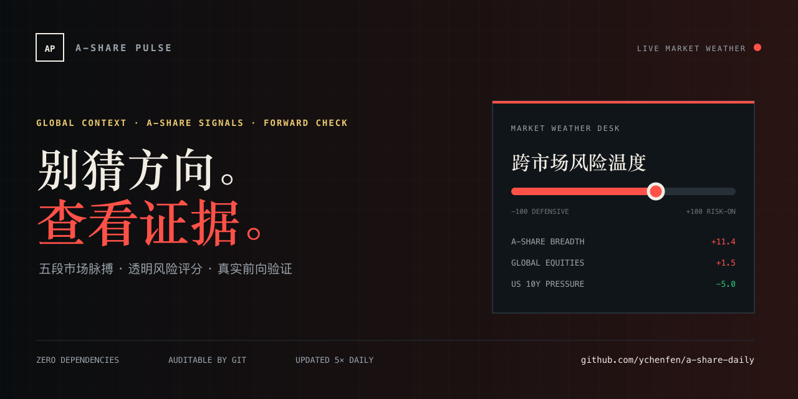
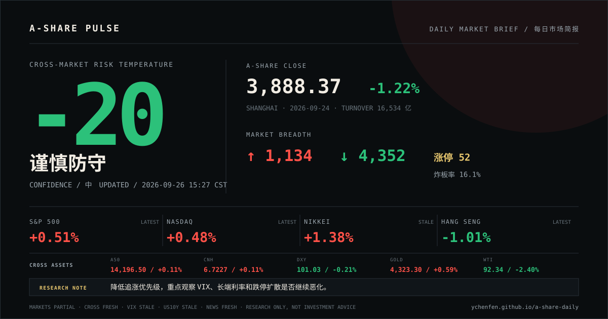
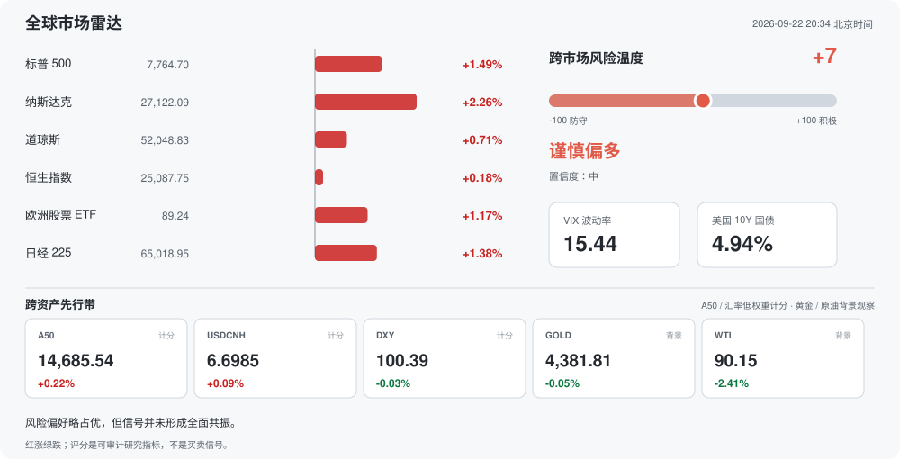
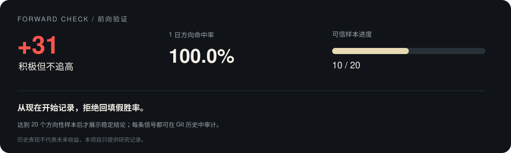
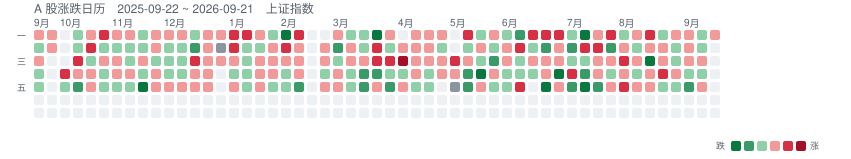
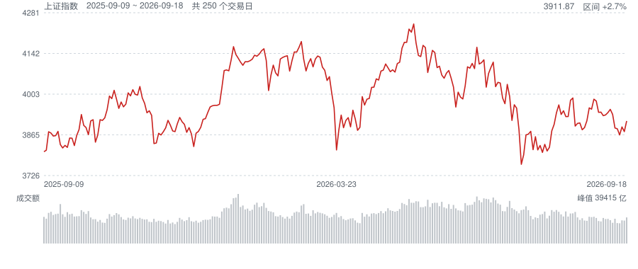
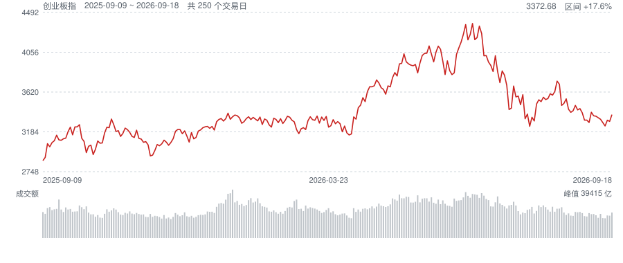

<div align="center">

# 📈 A-Share Pulse

**把 GitHub 提交图变成 A 股市场心电图。**

每天五次联动全球收盘、A 股盘中与新闻风险；零依赖、可审计、可直接 Fork。

<a href="https://github.com/ychenfen/a-share-daily/actions/workflows/daily.yml"></a>
<a href="https://ychenfen.github.io/a-share-daily/"></a>


<a href="LICENSE"></a>

[English](README.en.md) · 简体中文

</div>

<a href="https://ychenfen.github.io/a-share-daily/"></a>

> [!NOTE]
> **⚪ 休市 / 未开盘** · 目标日未开市或尚未产生行情，最近交易日 2026-09-24 · 最后检查 `2026-09-25 17:03`（北京时间）

[🌐 在线大屏](https://ychenfen.github.io/a-share-daily/) · [一键生成自己的版本](https://github.com/ychenfen/a-share-daily/generate) · [最新 JSON](data/latest.json) · [运行状态](data/status.json) · [完整历史](data/) · [数据字典](docs/DATA_SCHEMA.md) · [自动任务](https://github.com/ychenfen/a-share-daily/actions) · [讨论区](https://github.com/ychenfen/a-share-daily/discussions) · [路线图](ROADMAP.md) · [参与贡献](CONTRIBUTING.md)

## 为什么值得收藏

| 能力 | 你得到什么 |
| --- | --- |
| 🫀 五段市场脉搏 | 外围收盘 + A 股开盘、午间、收盘、夜间校验，不只是日终一个点 |
| 🧠 情绪温度计 | 涨跌家数、涨停/跌停、炸板率、最高连板和行业强弱 |
| 🟩 GitHub 风格日历 | 用红绿贡献格复刻近一年市场节奏，适合截图分享 |
| 🖥️ 在线研究大屏 | GitHub Pages 自动部署，手机和桌面都能直接查看 |
| 🌍 跨资产先行带 | A50、离岸人民币与美元指数低权重计分，黄金和原油保留为背景 |
| 🧭 事件传导链 | 新闻先去重分类，再映射宏观变量、A 股风格和可证伪条件 |
| 🗞️ 每日传播卡片 | 自动生成 1200×630 矢量简报，可下载、引用和转发 |
| 🧾 Git 原生数据湖 | 每次变化都有 diff，可追溯、可回滚，CSV/JSON 直接用于研究 |
| 🪶 零第三方依赖 | 只用 Python 标准库和 GitHub Actions，Fork 后无需服务器 |
| 🛡️ 质量门禁 | 每次推送前跑回归测试、schema 和重复日期检查 |

## 今日市场简报

<a href="https://ychenfen.github.io/a-share-daily/#share"></a>

[打开可交互大屏](https://ychenfen.github.io/a-share-daily/) · [下载 SVG](charts/daily_brief.svg)

## 全球市场与策略雷达



> **风险温度 -30 · 防守优先**（置信度：中）
> 内部市场与外围压力形成负向共振，先控制暴露并等待风险指标回落。

| 市场 | 地区 | 收盘 | 涨跌幅 |
| --- | --- | ---: | ---: |
| 标普 500 | 美国 | 7704.13 | -0.02% |
| 纳斯达克 | 美国 | 26939.37 | +0.01% |
| 道琼斯 | 美国 | 51349.98 | -0.31% |
| 恒生指数 | 中国香港 | 24510.09 | -1.01% |
| 欧洲股票 ETF | 欧洲（美股代理） | 88.07 | +0.07% |
| 日经 225 | 日本 | 65018.95 | +1.38% |

### 跨资产先行带

> A50 与美元/人民币组合仅作低权重评分；黄金和原油只提供风险背景，不直接加减分。

| 资产 | 角色 | 最新值 | 涨跌幅 | 状态 |
| --- | --- | ---: | ---: | --- |
| 富时中国 A50 期货 | 低权重计分 | 14,195.88 | +0.10% | 最新 |
| 美元兑离岸人民币 | 低权重计分 | 6.7231 | +0.11% | 最新 |
| 美元指数 | 低权重计分 | 101.11 | -0.13% | 最新 |
| COMEX 黄金 | 背景观察 | 4,331.99 | +0.79% | 最新 |
| WTI 原油 | 背景观察 | 92.31 | -2.43% | 最新 |

> ⚠️ 数据降级：全球指数、VIX、美债10Y本轮未完全刷新，已尽量保留最近有效值。

### 风险温度拆解

| 信号 | 当前值 | 分数贡献 | 解释 |
| --- | --- | ---: | --- |
| A股动量 | 上证 -1.22% | -9.8 | 反映本地市场价格强弱 |
| 市场宽度 | 涨 1134 / 跌 4352 | -11.7 | 上涨家数占优时提高风险偏好 |
| 短线情绪 | 涨停 52 / 跌停 13 / 炸板率 16.1% | +4.5 | 涨停扩散加分，炸板率过高扣分 |
| 外围股市 | 6 个市场均值 +0.02% | +0.1 | 衡量隔夜风险偏好共振 |
| A50 先行 | 富时 A50 +0.10% | +0.6 | 离岸期货只作低权重先行确认，避免重复计算 A 股现货动量 |
| 美元与人民币 | USD/CNH 6.7231 (+0.11%) / DXY 101.11 (-0.13%) | -0.7 | 美元走弱与人民币走强通常缓解外部流动性压力 |
| 波动压力 | VIX 15.44 | +0.0 | VIX 越高，全球避险需求通常越强 |
| 利率压力 | 美债 10Y 4.94% | -5.0 | 长端利率偏高时压制高估值资产 |
| 新闻语气 | 正向词 0 / 风险词 7 | -8.0 | 标题关键词只做低权重提示，不代替事实核验 |

### 事件传导链

> 去重标题只作为待验证线索；分类数量不是已确认事件，传导链也不直接参与评分。

| 事件线索 | 宏观传导 | A 股映射 | 观察指标 | 失效条件 |
| --- | --- | --- | --- | --- |
| 央行与利率（4 条） | 政策利率预期 → 美债收益率与美元 → 全球流动性 | 高估值成长、券商、地产与人民币敏感资产 | 美债10Y 4.94%（最近有效值） / 美元指数 101.11 / -0.13%（最新） / USD/CNH 6.7231 / +0.11%（最新） | 失效条件：若美债利率、美元与人民币没有同向确认，标题冲击可能只是短期噪音。 |
| 商品与成本（3 条） | 商品价格 → 输入成本与通胀预期 → 企业利润分配 | 能源、化工、有色、航空运输与中下游成本敏感行业 | 原油 92.31 / -2.43%（最新） / 黄金 4,331.99 / +0.79%（最新） / 美债10Y 4.94%（最近有效值） | 失效条件：若现货代理价格未确认标题方向，暂不推断产业链利润迁移。 |
| 通胀与就业（1 条） | 通胀与就业数据 → 降息路径与实际利率 → 估值折现率 | 成长估值、可选消费、资源品与利率敏感板块 | 美债10Y 4.94%（最近有效值） / 美元指数 101.11 / -0.13%（最新） / 纳斯达克 26,939.37 / +0.01%（最新） | 失效条件：若实际利率与美元反向运行，单条数据不应直接外推为持续风格切换。 |
| 地缘与贸易（1 条） | 地缘风险 → 油金与波动率 → 通胀预期和风险偏好 | 黄金、能源、军工、航运与出口链风险敞口 | VIX 15.44（最近有效值） / 黄金 4,331.99 / +0.79%（最新） / 原油 92.31 / -2.43%（最新） | 失效条件：若 VIX、黄金和原油没有共振，事件尚未形成可交易的跨资产冲击。 |

### 研究观察

- 研究上优先压力测试与回撤控制，避免仅凭单条利好逆势下注。

### 新闻雷达

- [一周展望：黄金扛住加息盯4500，特朗普“大决定”将至，沙特危局升温-市场参考](https://news.google.com/rss/articles/CBMiT0FVX3lxTE81cFV1akwwam4wSU9kZkRseDZfZmt4SHZJYUdxdjRhdU9PTTJJaWN0Z294NEdWV29rMi1QeEJKN2pZdjAzQm83ZWxXVTNGU1k?oc=5) · 金十数据
- [全线下跌！美联储加息，传来新消息](https://news.google.com/rss/articles/CBMiXEFVX3lxTE1oTnhQN3lwQ2Npa3BGYmNfVzFtYWxoRng1ZHMzSERENlBHZG5XR3VOYm83RVFaRXpILUZrd2x0dnZTaGt6Z1JnQXE5QjhuNGk2TGhhUE5NR0NMX1Bw?oc=5) · 证券时报网
- [Amillex安迈每日汇评｜地缘风波与鹰派施压，黄金回落油价冲高](https://news.google.com/rss/articles/CBMiU0FVX3lxTE9XdENDWkk0UlJ5cVJLbGJWd1ZnRmR4TjFXTy1mczc4bXJ5elB1ZWtLeld4UW85QUZkeThfbXVoMVdORnRsUmp3aTBxSFgxbDZfODFJ?oc=5) · FX168财经
- [日本10年期国债收益率冲上1996年来新高 全球债市抛售潮席卷东京](https://news.google.com/rss/articles/CBMiigFBVV95cUxOVVdGc1A1c0FMUC1FMkJ0VjlOSGd4TzVpN0E1SHBtNFRZclFaQkRuR2YyYXNNQVYxQWhHTXBvbEJIWUJUT3VnUVBtTWdFYU4tck1ubHllUU13ZWwxTHBvQ0RpVkJ1OEFkQlU3OXh1SExGYzZfc0NvUjM2aXFVWmdBZnBTYXBjWkJzVnc?oc=5) · finance.sina.com.cn
- [美债惊魂 石油大涨 央行再发声](https://news.google.com/rss/articles/CBMia0FVX3lxTFBGTUtNZ1RIU01XcXlMd2ppM2lDMlBBc0loaWdPVDJaUGdpQ25SNGJ0WUN1ZUVyX1BsalNjeUJaWWE2SW1OSnRna1NJQkRoQ1p3aWFBeG93YWpNeElqSDhLVEw1MjBiVy1YcnNz?oc=5) · 财富号
- [海外研选日报0924 \| 美银：美联储年内或再加息两次 美股回调风险上升](https://news.google.com/rss/articles/CBMibkFVX3lxTE5aSmJQdFpnZlhDbjZqWE1sSHUxZ2dVUUdMa3c3cWctSFdhQnFRek81Wm9CYnJranVqRHliM2hpSV94cW5xMC1sLVJKbWpodWQ5MXlYZnhmV0E5SHFDaFU4cXRGZHZXMVVPdEtpMFFR?oc=5) · finance.sina.com.cn

方法：透明规则评分：A股动量、市场宽度、短线情绪、外围股市、A50先行、美元与人民币、VIX、美债10Y和新闻标题低权重语气；黄金与原油只作背景，事件传导链不直接计分。

> 这是可审计的通用市场研究提示，不是个性化仓位或买卖建议。

## 信号成绩单



> 1 日方向命中率 **91.7%**，当前有效样本 **24** 条。

方法：开盘/午间信号验证当日收盘，收盘/夜间信号验证下一交易日；同时持续结算 3 日和 5 日复合收益。

> 样本不足时不输出稳定性结论，历史表现也不代表未来收益。

## 走势







## 最近 10 个交易日

| 日期 | 上证 | 深成 | 创业板 | 沪深300 | 科创50 | 成交额(亿) | 涨/跌/平 | 涨停 | 跌停 |
| --- | --- | --- | --- | --- | --- | --- | --- | --- | --- |
| 2026-09-24 | 3888.37<br>-1.22% | 13316.97<br>-2.34% | 3288.95<br>-2.68% | 4439.14<br>-1.73% | 1621.87<br>-2.35% | 16534 | 1134/4352/148 | 52 | 13 |
| 2026-09-23 | 3936.52<br>-0.39% | 13636.07<br>-0.64% | 3379.61<br>-0.60% | 4517.28<br>-0.60% | 1660.85<br>-0.25% | 17650 | 1910/3605/118 | 51 | 13 |
| 2026-09-22 | 3952.13<br>+0.06% | 13723.74<br>-0.05% | 3399.93<br>+0.01% | 4544.59<br>+0.11% | 1665.04<br>+0.46% | 21356 | 2391/3077/163 | 63 | 3 |
| 2026-09-21 | 3949.91<br>+0.97% | 13730.02<br>+0.65% | 3399.59<br>+0.80% | 4539.57<br>+0.71% | 1657.48<br>+0.29% | 20315 | 4583/951/96 | 103 | 2 |
| 2026-09-18 | 3911.87<br>+0.94% | 13640.87<br>+1.72% | 3372.68<br>+2.25% | 4507.39<br>+1.06% | 1652.63<br>+2.88% | 20771 | 4277/1173/180 | 78 | 0 |
| 2026-09-17 | 3875.60<br>-0.41% | 13409.91<br>-0.33% | 3298.31<br>-0.40% | 4460.16<br>-0.45% | 1606.29<br>-0.61% | 18231 | -/-/- | - | - |
| 2026-09-16 | 3891.60<br>+0.71% | 13454.74<br>+1.26% | 3311.47<br>+1.96% | 4480.27<br>+0.68% | 1616.19<br>+4.14% | 18391 | -/-/- | - | - |
| 2026-09-15 | 3864.28<br>-0.54% | 13287.97<br>-0.72% | 3247.92<br>-1.15% | 4450.04<br>-0.67% | 1551.96<br>+1.55% | 16127 | -/-/- | - | - |
| 2026-09-14 | 3885.33<br>-0.07% | 13384.57<br>-0.64% | 3285.58<br>-1.10% | 4480.08<br>-0.67% | 1528.27<br>-1.62% | 16292 | -/-/- | - | - |
| 2026-09-11 | 3888.11<br>-1.18% | 13471.26<br>-1.08% | 3322.04<br>-0.49% | 4510.16<br>-0.84% | 1553.39<br>-1.01% | 19719 | -/-/- | - | - |

完整历史在 [data/](data/) 目录，共 663 个交易日。

## 市场情绪

最新交易日 2026-09-24：

- 涨停 **52** 家，跌停 **13** 家
- 炸板 10 家，炸板率 **16.1%**（越高说明封板越不牢）
- 最高 **7** 连板，2 板及以上共 19 家

| 日期 | 涨停 | 跌停 | 炸板 | 炸板率 | 最高连板 | 连板家数 |
| --- | --- | --- | --- | --- | --- | --- |
| 2026-09-24 | 52 | 13 | 10 | 16.1% | 7 | 19 |
| 2026-09-23 | 51 | 13 | 26 | 33.8% | 9 | 14 |
| 2026-09-22 | 63 | 3 | 18 | 22.2% | 9 | 27 |
| 2026-09-21 | 103 | 2 | 25 | 19.5% | 17 | 31 |
| 2026-09-18 | 78 | 0 | 25 | 24.3% | 16 | 18 |

## 行业板块

2026-09-24 领涨与领跌各五个：

| | 行业 | 涨跌幅 | 主力净流入(亿) | 领涨股 |
| --- | --- | --- | --- | --- |
| 领涨 | 林业Ⅲ | +5.83% | 6.39 | 平潭发展 |
|  | 林业Ⅱ | +5.83% | 6.39 | 平潭发展 |
|  | 其他医疗服务 | +4.29% | 2.01 | 合富中国 |
|  | 其他家电Ⅲ | +4.24% | 0.74 | 奥佳华 |
|  | 其他家电Ⅱ | +4.24% | 0.74 | 奥佳华 |
| 领跌 | 白银 | -4.83% | -3.80 | 兴业银锡 |
|  | 印制电路板 | -4.74% | -74.13 | 中京电子 |
|  | 广告媒体 | -4.70% | -0.50 | 分众传媒 |
|  | 贵金属 | -4.63% | -13.30 | 招金黄金 |
|  | 医疗研发外包 | -4.61% | -22.41 | 和元生物 |

## 自动更新节奏

| 北京时间 | 记录内容 | 正式日线 |
| --- | --- | --- |
| 06:15 | 外围收盘：美股、日股、港股、VIX、美债与新闻 | 否 |
| 10:05 | 开盘脉搏：指数、成交额、涨跌家数 | 否 |
| 11:35 | 午间脉搏：上午收束状态 | 否 |
| 15:10 | 收盘快照：完整行情、情绪和行业排行 | 是 |
| 20:20 | 夜间校验：复核收盘数据与数据源健康 | 是 |

GitHub Actions 可能有数分钟调度延迟。休市日不会伪造行情，只刷新状态和审计日志。

## 数据与复用

```text
data/YYYY.csv          # 日线与收盘情绪，适合回测
data/pulses/YYYY-MM.csv # 日内四段观察，适合研究盘中演化
data/sectors.csv        # 行业领涨/领跌 Top 5
data/global.json         # 全球指数、A50、汇率、美元、黄金、原油、VIX 与美债
data/analysis.json       # 可解释风险温度、新闻与研究观察
data/scorecard.json      # 真实运行信号的前向验证成绩单
data/signals/YYYY.csv    # 每次风险信号的可审计原始记录
data/latest.json        # 程序最方便消费的聚合入口
data/status.json        # 最近任务与数据源健康状态
```

本地运行不需要安装依赖：

```bash
python3 scripts/snapshot.py
python3 scripts/global_context.py
python3 scripts/scorecard.py
python3 scripts/share_card.py
python3 scripts/chart.py
python3 -m unittest discover -s tests -v
python3 scripts/validate.py
```

想拥有自己的市场心电图，直接用模板生成仓库并开启 Actions 即可。更多字段说明见 [数据字典](docs/DATA_SCHEMA.md)。

## 数据来源与边界

指数行情来自腾讯行情公开接口；市场宽度、涨跌停池和行业排行来自东方财富公开接口。接口异常时保留上一份有效数据，并在 `status.json` 明确标记，不把空响应冒充成功。

全球指数来自腾讯公开行情，A50、离岸人民币、美元指数、黄金与原油来自新浪财经公开行情，宏观压力来自 FRED；新闻区只保留Google News RSS 的标题、来源和链接，不抓取或改写正文。

指数历史由 [scripts/backfill.py](scripts/backfill.py) 一次性回填。涨跌家数、涨停跌停、连板梯队这些是盘后快照，没有历史接口可回填，只能逐日累积，所以回填日期的这几列是空的。

> 本项目仅用于数据记录与技术研究，不构成投资建议。公开接口可能调整，请以交易所和数据服务商正式口径为准。

---

如果它帮你省下了整理行情的时间，欢迎点一个 ⭐。想一起完善信号、数据源或可视化，可以先到 [讨论区](https://github.com/ychenfen/a-share-daily/discussions) 交流，或从 [贡献指南](CONTRIBUTING.md) 开始。
